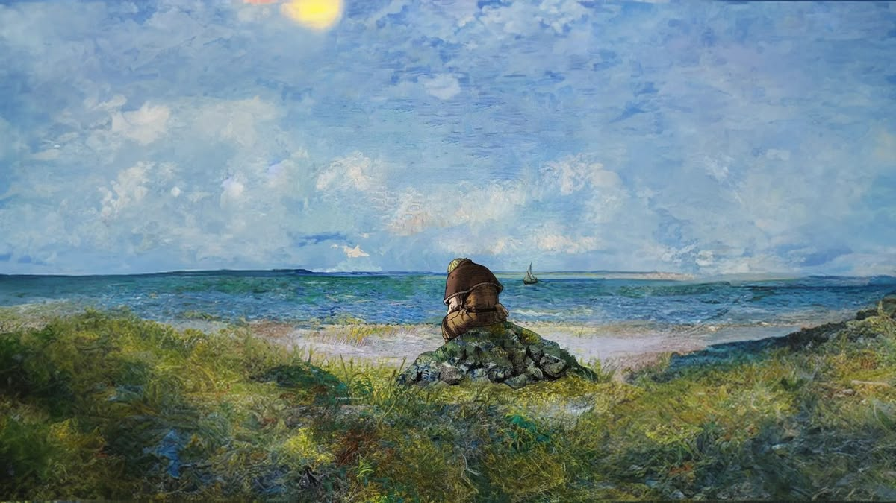

  

 

*Estudante de Desenvolvimento de Sistemas - SENAI Cruzeiro*

---

## Sobre mim 🥊

Gosto de tecnologia, esportes, ver filmes e ler  
Sempre buscando melhorar meus projetos

 

## Ferramentas 👨🏻‍💻

 

 

## Redes Sociais 🤳🏻

  

Instagram: **@joaquim.rcosta**

 

